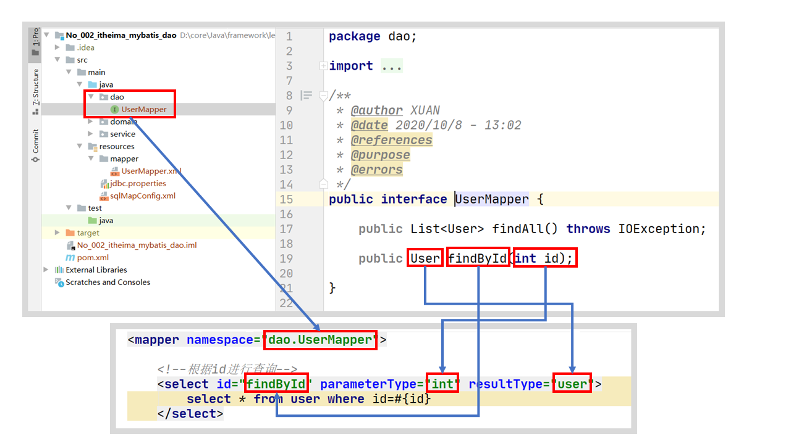

# No_002_itheima_mybatis_dao

## 代理开发方式

### 代理开发方式介绍

采用 Mybatis 的代理开发方式实现 DAO 层的开发，这种方式是我们后面进入企业的主流。

Mapper 接口开发方法只需要程序员编写Mapper 接口（相当于Dao 接口），由Mybatis 框架根据接口定义创建接口的动态代理对象，代理对象的方法体同上边Dao接口实现类方法。

Mapper 接口开发需要遵循以下规范：

1. **Mapper.xml文件中的namespace与mapper接口的全限定名相同**
2. **Mapper接口方法名和Mapper.xml中定义的每个statement的id相同**
3. **Mapper接口方法的输入参数类型和mapper.xml中定义的每个sql的parameterType的类型相同**
4. **Mapper接口方法的输出参数类型和mapper.xml中定义的每个sql的resultType的类型相同**

### 编写UserMapper接口

